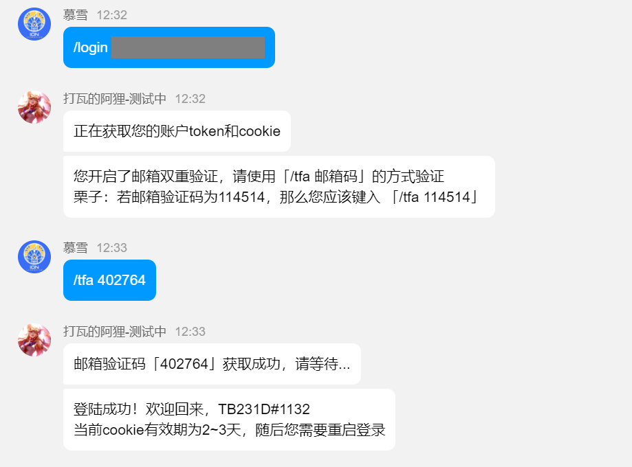

<h1 align="center">QQ-Valorant-Bot</h1>

<h4 align="center">这是一个QQ频道的「Valorant」机器人</h4>

<div align="center">

  
[](https://kook.top/gpbTwZ) 

</div>


## 1.当前支持的命令

目前为初始版本，调用 [kook-valorant-bot](https://github.com/musnows/Kook-Valorant-Bot) 的画图Api移植而来; 


| Cmd        | Function                                                     |
| --------------- | ------------------------------------------------------------ |
| `/ahri` or `/help`         | 帮助命令 |
| `/login account passwd`         | 登录 riot 账户 |
| `/tfa verify-code`         | 提供邮箱验证码  |
| `/shop` or `/store`       | 查询每日商店 |
| `/uinfo`       | 查询 vp,rp,用户等级 |

QQ频道特色，所有命令在公频使用的时候，需要先at机器人




## 2.依赖项

BOT采用官方提供的 [Python sdk](https://github.com/tencent-connect/botpy)

```
pip install qq-botpy
```
sdk使用示例请查看官方git仓库 [qq-botpy](https://github.com/tencent-connect/botpy) 中的的example

拳头cookie重登依赖于 [floxay/python-riot-auth](https://github.com/floxay/python-riot-auth)

### 2.1 config

要想使用本bot，请在 `code/config` 目录下创建 `config.json` 文件

```json
{
  "bot":{
      "appid": "机器人appid",
      "token": "机器人token",
      "val_api_url": "https://val.musnow.top/api",
      "val_api_token": "val_api_token",
      "master_id":"机器人开发者id"
  },
  "guild":{}
}
```

其中 `val_api_token` 的获取详见 [valorant-api-docs](https://github.com/Valorant-Shop-CN/Kook-Valorant-Bot/blob/develop/docs/valorant-shop-img-api.md)

`guild` 字段的作用，是用于设置某一个频道只允许某几个频道使用机器人。如果服务器id不在此字段内，则不会进行限制，所有子频道都能私聊机器人。若需要限制，必须修改配置文件

比如，频道id `xxxxx` 的腐竹，只允许用户在子频道id `abcd` 和 `efg` 中使用机器人，则可以按如下配置。

```json
"guild":{
  "xxxxx":[
    "abcd",
    "efg"
  ]
}
```

更多 config 文件的字段，可直接查看示例文件 [config.exp.json](./code/config/config.exp.json)

### 2.2 log

Bot运行时需要多个依赖项文件，完整的文件列表详见 [FileManage](./code/utils/FileManage.py)

请在 `code/log` 目录下创建 `UserAuthID.json`，初始化为如下字段

```json
{
  "ap_log": {},
  "data": {}
}
```

其余需要的文件均和kook机器人需要的文件同名，参考 [docs/log.example](https://github.com/musnows/Kook-Valorant-Bot/tree/develop/docs/log.example)


### 支持本项目😘

阿狸的支出主要为云服务器的费用，您的支持是对作者的最大鼓励！

<a href="https://afdian.net/a/128ahri">
    
</a >